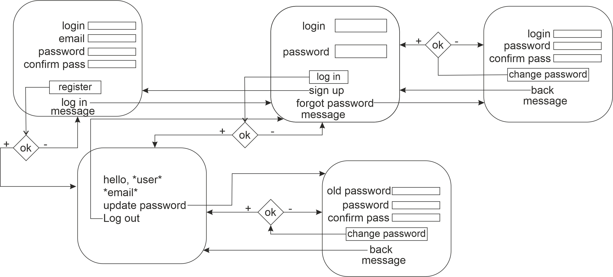
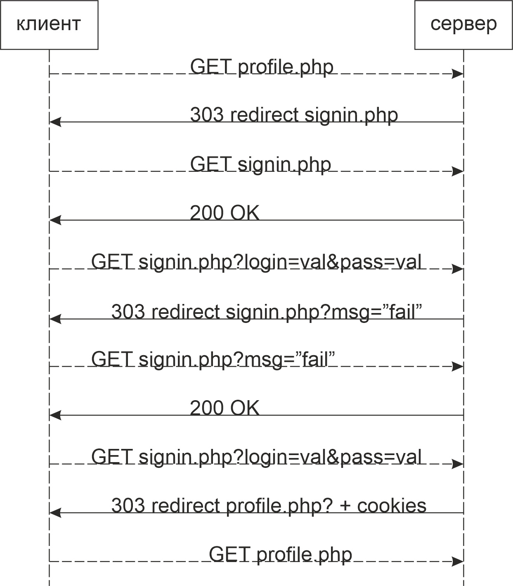
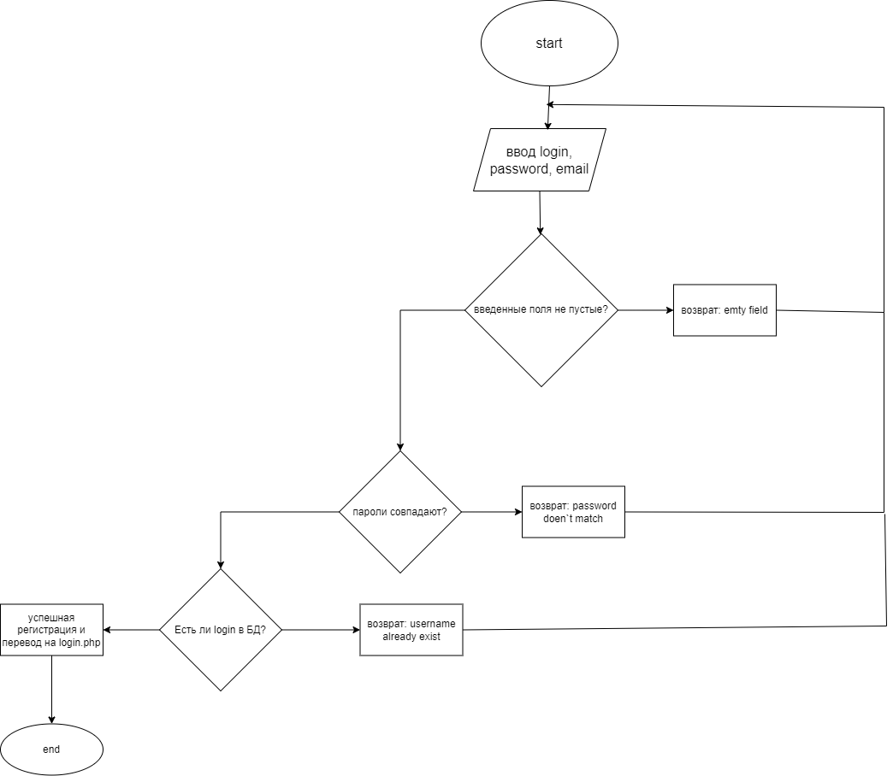
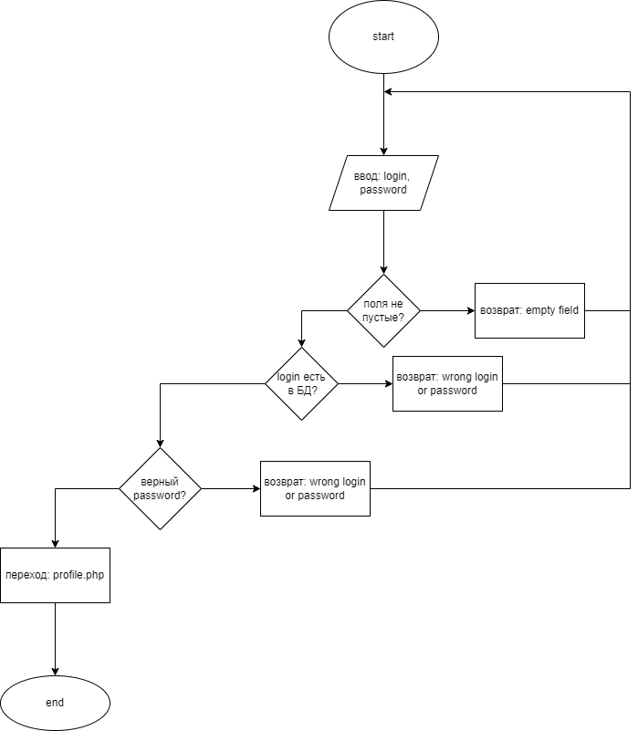
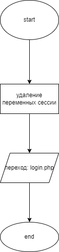
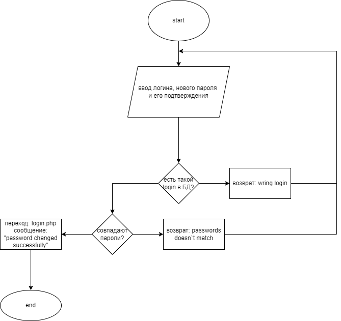
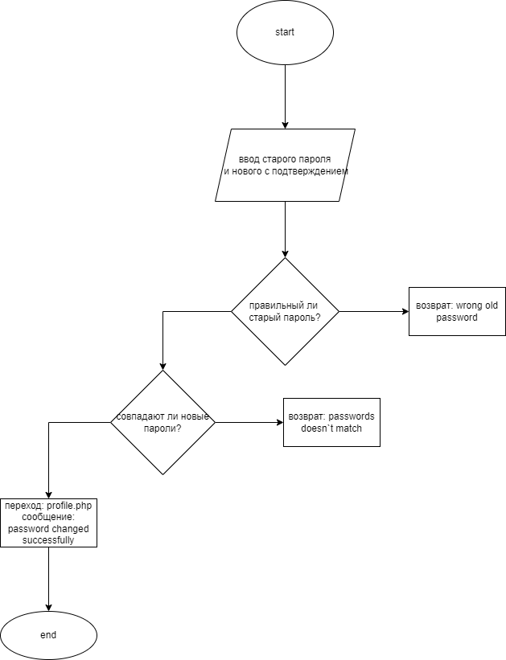

# HTTP аутентификация

## Текст задания
### Цель работы
Спроектировать и разработать систему авторизации пользователей на протоколе HTTP

## Ход работы

1) [Пользовательский интерфейс](https://www.figma.com/file/rAE7J5cg0buD9sJShTWYQM/IS_lr_1?node-id=31%3A2)

2) Пользовательские сценарии работы

3. API сервера и хореография\

4. Структура БД

| id | login | email | password |

- id : INT(11), PRIMARY KEY, AUTO_INCREMENT
(уникальный идентификатор пользователя)
- login : VARCHAR(250), по умолчанию NULL
(логин)
- email: VARCHAR(255), по умолчанию NULL
(почта)
- pass: VARCHAR(500), по умолчанию NULL
(хешированный пароль)

5) Алгоритмы

- регистация\

- авторизация\

- выход\

- восстановление пароля\

- обновление пароля\

## Значимые фрагменты кода

В репозитории представлены все исходные файлы по лабораторной
